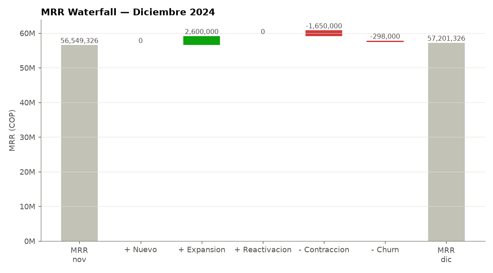
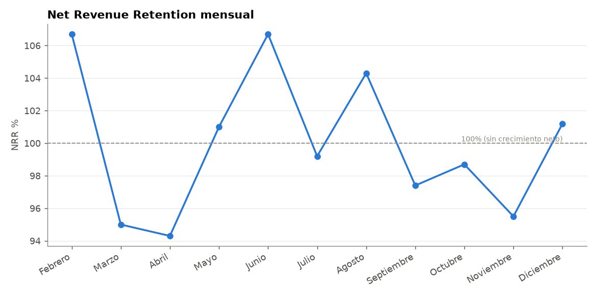
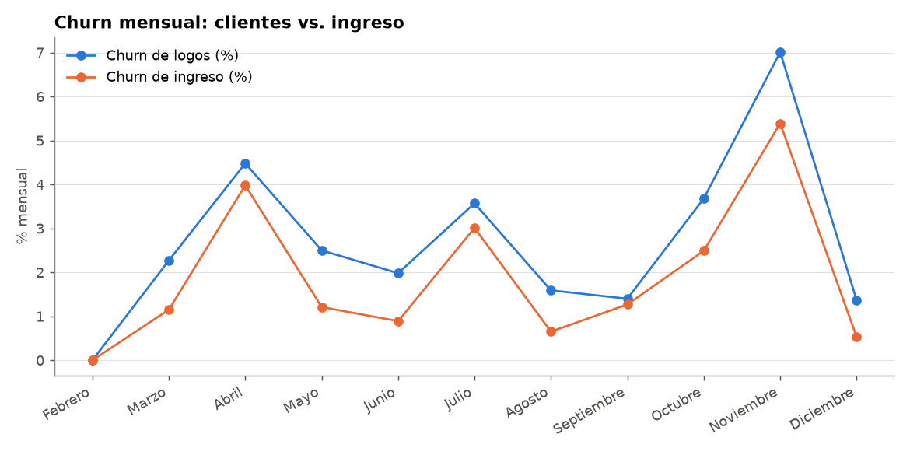
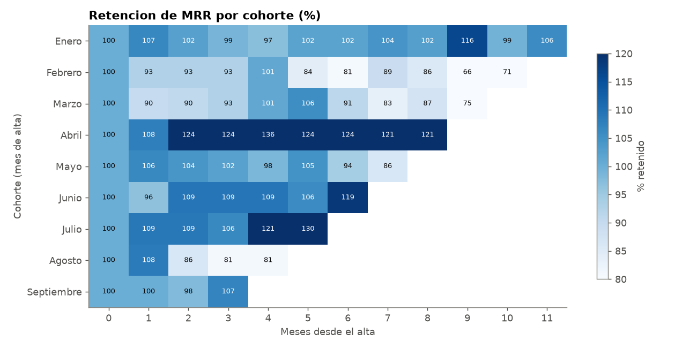
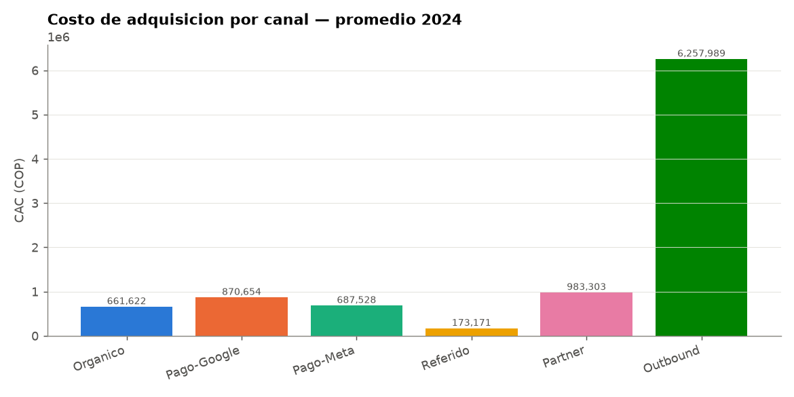
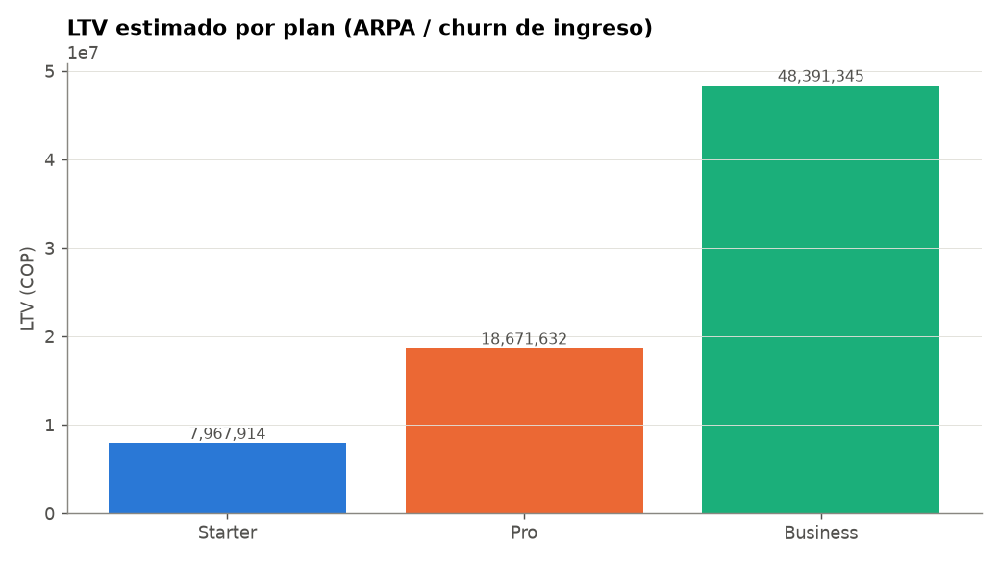

# Informe — SaaS Metrics (proyecto ficticio, Reto Alegra)

## Qué es esto y qué no es

Un SaaS ficticio, con datos 100% sintéticos generados con semilla fija (reproducibles).
Ninguna cifra de este informe corresponde a Alegra ni a ningún cliente real. Construido
para la Actividad 1 del proceso de selección de Business Intelligence & Analytics
Partner, con Claude Code como copiloto en cada etapa — de la generación de datos a las
vistas SQL, los notebooks y este mismo informe.

**El problema que resuelve:** un SaaS que factura desde Stripe, gestiona su embudo en
un CRM estilo HubSpot y firma contratos formales para sus cuentas grandes, sin que los
tres sistemas compartan un identificador común. La pregunta de negocio — *¿cuál es el
MRR real, y por qué no cuadra entre sistemas?* — exige resolver esa identidad antes de
poder confiar en cualquier métrica.

---

## Arquitectura

Cuatro capas sobre SQLite (raw → bronze → silver → gold): un origen nuevo solo agrega un
lector hacia Bronze, sin tocar Silver ni Gold. Power BI, los notebooks y el agente
conversacional leen **solo** de gold. Detalle completo en
`notebooks/01_arquitectura_y_modelo.ipynb`.

---

## Lo que encontró el pipeline al integrar los 3 sistemas

Cada una de las 247 empresas de `dim_cliente` queda con un estado de calidad
(`gold_v_calidad_clientes`):

| Estado | Empresas | MRR inicial involucrado | Qué significa |
|---|---:|---:|---|
| OK | 157 | 52.935.830 | Cliente de pago cruzado automáticamente entre sistemas |
| Rebranding | 16 | 4.140.050 | Cambió de razón social; resuelto por el ID del CRM, no por el nombre |
| Huérfano / ambiguo | 17 | 1.145.000 | **Sin resolución automática**: revisión manual (ver abajo) |
| Cliente sin eventos válidos | 2 | — | Su única alta cayó en cuarentena: su MRR no está contado |
| Lead sin facturación | 55 | — | Lead o trial que nunca pagó: no es un error |

**El hallazgo más interesante no estaba planeado:** al generar los datos sintéticos,
`Faker` produjo por azar tres nombres de empresa que quedaron compartidos por dos
empresas distintas del CRM ("Rivera Group", "Castillo LLC", "Gomez-Quintero"; en el caso
de "Rivera Group", una de las dos llegó a ese nombre por un rebranding). Resolver
identidad solo por nombre normalizado habría fusionado esas 6 empresas en 3, en
silencio. La solución fue anclar Billing por `id_customer_stripe` (el identificador
estable de ese sistema, igual que el CRM se ancla por `id_contacto_crm`) y neutralizar
cualquier nombre reclamado por más de una empresa, en vez de asignarlo al primero que
apareció.

Los 17 huérfanos se descomponen así:

- **5 en Billing:** la facturación de 5 de esas empresas, cada una anclada por su
  `id_customer_stripe`. Son los únicos huérfanos con MRR (1.145.000 COP en altas).
- **5 en el CRM:** esas mismas 5 empresas vistas desde el CRM, con el nombre
  neutralizado. Unir cada una con su par de Billing requiere un dato que el nombre no da
  (NIT, email de facturación): es revisión manual.
- **7 en Contratos:** 5 con un error de digitación que la normalización no corrige
  (espacios dentro de la razón social, por ejemplo `"LOA IZA , ESPINOSA A ND SOLA NO S.A.S."`)
  y 2 con un nombre ambiguo.

El costo de esa prudencia es que 17 registros quedan para revisión en vez de fusionados
por error — **y eso es exactamente lo correcto.**

**Rebranding: 16 de 17.** La verdad de la simulación tiene 17 empresas renombradas. La
número 17 ("Leal Inc", renombrada "Rivera Group") se resolvió bien por su ID del CRM,
pero su nombre nuevo es uno de los ambiguos, así que no queda marcada como rebranding.

**Cuarentena:** 3 filas de Billing llegaron sin `tipo_evento` y se aislaron en
`err_registro_rechazado`, con su número de línea, en vez de descartarse en silencio o
adivinar su clasificación. Dos eran la única alta de su cliente ("Uribe and Sons" y
"González-Rodríguez", ambos plan Pro): esos 2 clientes no aparecen en el MRR y quedan
como `CLIENTE_SIN_EVENTOS_VALIDOS`. La tercera era el alta de "Mena PLC", que en agosto
hizo upgrade.

---

## Métricas SaaS — 2024

| Métrica | Valor |
|---|---:|
| MRR (diciembre) | **57.201.326 COP** |
| ARR (diciembre) | **686.415.912 COP** |
| Clientes activos (diciembre) | **144** |
| NRR promedio | **100,0%** (rango 94,3% – 106,7%) |
| Churn de logos promedio | **2,71% mensual** |
| Churn de ingreso promedio | **1,87% mensual** |



**El NRR queda bajo 100% en 6 de 11 meses** (marzo, abril, julio, septiembre, octubre y
noviembre). La caída del MRR de octubre y noviembre no es un problema comercial: la
simulación no tiene altas después de septiembre (supuesto declarado), así que nada
compensa el churn de esos meses.



**Churn de ingreso menor que churn de logos en 10 de los 11 meses medidos** (febrero no
tuvo bajas): los clientes que se van tienden a ser de plan Starter, no los de mayor MRR,
así que la base de ingresos resiste mejor de lo que sugiere contar clientes perdidos.





### CAC por canal (2024: gasto total / clientes nuevos)

| Canal | CAC (COP) |
|---|---:|
| Referido | **173.171** |
| Organico | 661.622 |
| Pago-Meta | 687.528 |
| Pago-Google | 870.654 |
| Partner | 983.303 |
| **Outbound** | **6.257.989** |

El CAC del año se calcula como gasto total del año dividido por clientes nuevos del año,
no como promedio de los CAC mensuales (que pesaría igual un mes con 1 alta que uno con
10). Las 5 altas de los huérfanos de Billing no tienen canal conocido, así que el CAC
cuenta 172 de las 177 altas.



### LTV por plan

| Plan | ARPA (COP) | LTV (COP) | Churn propio del plan | LTV con churn del plan | Bajas del plan en el año |
|---|---:|---:|---:|---:|---:|
| Starter | 149.000 | 7.967.914 | 3,94% | 3.777.150 | 20 |
| Pro | 349.160 | 18.671.632 | 3,05% | 11.452.314 | 14 |
| Business | 904.918 | 48.391.345 | 0,50% | 181.606.737 | 1 |

El LTV principal usa el churn de ingreso promedio de toda la compañía (1,87%) para los
tres planes, así que la diferencia entre planes sale **solo del ARPA**. La sensibilidad
con el churn propio de cada plan muestra cuánto cambia la foto: un Starter vale menos de
la mitad, y Business se dispara, aunque con una sola baja en el año esa cifra no es
confiable. Ninguna de las dos descuenta margen bruto (ver `docs/DICCIONARIO_METRICAS.md`).



### LTV:CAC por canal — la pregunta para Growth

`gold_v_ltv_cac_por_canal` cruza el CAC de cada canal con la mezcla **real** de planes
con la que entró cada canal (altas por plan), no con un plan supuesto:

| Canal | CAC (COP) | Altas Starter / Pro / Business | LTV:CAC | Con churn por plan |
|---|---:|---|---:|---:|
| **Outbound** | 6.257.989 | 7 / 7 / 1 | **2,5x** | 3,1x |
| Partner | 983.303 | 9 / 4 / 1 | 14,2x | 19,0x |
| Pago-Google | 870.654 | 16 / 15 / 5 | 20,7x | 36,4x |
| Organico | 661.622 | 12 / 19 / 4 | 27,8x | 42,7x |
| Pago-Meta | 687.528 | 14 / 16 / 9 | 31,5x | 69,8x |
| **Referido** | 173.171 | 21 / 9 / 3 | **84,1x** | 127,3x |

**Outbound es el único canal por debajo del umbral de referencia de 3:1**, y cuesta 36
veces más por cliente que Referido. El problema está en su mezcla: casi la mitad de sus
altas son Starter. Un Starter traído por Outbound rinde ≈1,3x con el LTV principal, y con
el churn propio de Starter (LTV ≈3,8M) ni siquiera recupera los 6,3M que costó. Su
sensibilidad de 3,1x viene inflada por la única alta Business, cuyo LTV por plan no es
confiable. Es la primera pregunta que le haría al equipo de Growth: ¿Outbound se está
usando para cerrar cuentas grandes, o está prospectando indiscriminadamente?

---

## Advertencia metodológica: por qué la reconciliación no da 100% exacto (y por qué eso es correcto)

Al comparar el pipeline reconstruido contra la verdad de control (`data/control_totales.json`,
calculada *antes* de ensuciar los datos), las altas y el MRR nuevo cuadran exacto en **10 de
12 meses** (difieren marzo y mayo, los meses de las altas en cuarentena). El MRR a diciembre
difiere **−574.210 COP (~1%)**. Hay dos causas, ambas identificadas:

1. **Cuarentena en cascada (la principal).** Las 3 filas en cuarentena no solo faltan ellas
   mismas: las dos altas únicas perdidas sacan a sus clientes del MRR de todo el año, y el
   alta perdida de "Mena PLC" hace que su upgrade de agosto entre al MRR sin "plan
   anterior" (349.000 COP que no se pueden clasificar como expansión). Es un efecto real
   de la pérdida de datos, no un error del pipeline.
2. **Tipo de cambio de los clientes en USD (menor).** El MRR de un cliente que factura en USD
   queda registrado a la tasa del mes de su último evento, mientras que su baja o cambio de
   plan se valora a la tasa del mes en que ocurre. En noviembre un cliente Business en USD
   canceló: el MRR lo traía en 915.170 COP y el churn lo valoró en 902.060 COP (13.110 COP de
   diferencia). La verdad de control, en cambio, remide a todos los clientes USD con la tasa
   de cada mes. Es una convención de medición, no una pérdida de datos. Si el negocio
   prefiere remedir el MRR en USD mes a mes, habría que cambiarla en
   `gold_v_estado_cliente_mensual`.

Por eso el waterfall no suma exacto a la variación del MRR en 3 meses: julio (4.984 COP) y
noviembre (−13.110 COP) por tipo de cambio, y agosto (349.000 COP) por la cuarentena en
cascada.

**No se forzó una reconciliación perfecta artificial.** Un pipeline que "cuadra
siempre" sobre datos con pérdida real de información está adivinando en algún punto.
El detalle mes a mes está en `notebooks/03_carga_y_calidad.ipynb`.

---

## Verificaciones ejecutadas

| Verificación | Resultado |
|---|---|
| `PRAGMA foreign_key_check` | Sin violaciones |
| Reconciliación mensual contra `control_totales.json` | Altas y MRR nuevo exactos en 10/12 meses; MRR a diciembre −574.210 COP (~1%), explicado (ver arriba) |
| Los 4 notebooks ejecutan de principio a fin | Verificado con `nbclient`, sin rutas absolutas |
| Filas rechazadas van a cuarentena, no se descartan en silencio | 3 filas, con motivo y número de línea |
| Clientes con identidad ambigua no se fusionan por error | 3 nombres ambiguos detectados y separados |
| Cada cifra de este informe, del README y de las preguntas de demo | `python pruebas/test_cifras.py` → 10/10 |
| Gobernanza del agente conversacional | `python pruebas/test_guardrails.py` → 34/34; `python pruebas/smoke_mcp.py` → 10/10 |

---

## Contenido del repositorio

```
data/        generador de datos sinteticos + seeds + verdad de control
sql/         DDL (bronze/silver/control) + vistas gold
notebooks/   01 arquitectura · 02 generar datos · 03 carga y calidad · 04 metricas
powerbi/     vistas gold exportadas a CSV + proyecto .pbip
agente/      servidor MCP gobernado sobre la capa gold
pruebas/     guardrails, protocolo MCP, cifras publicadas + preguntas de demo
docs/        este informe, el diccionario de metricas, la guia del agente, el guion del video
db/          saas_metrics.db (SQLite poblado y verificado)
cargar_datos.py · exportar_csv.py · lib_comun.py
```

---

Construido con **Claude Code** como copiloto de principio a fin — desde el diseño de
la arquitectura hasta la detección de la colisión de nombres que ningún plan original
contemplaba.
